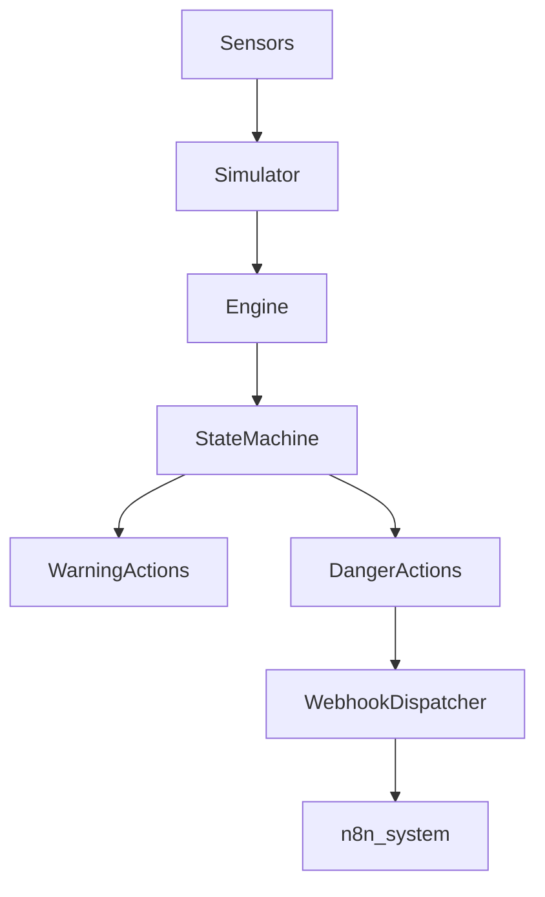

# ChildSafe System


A Python prototype of an in-vehicle child safety monitoring system.

The system simulates a smart safety unit installed in a vehicle that detects dangerous cabin conditions when a child might be left inside a locked car.

It monitors:

- Cabin temperature
- CO2 concentration
- Vehicle lock state
- Engine state

Based on these signals, the system determines whether the situation is:

- NORMAL
- WARNING
- DANGER

and triggers appropriate safety actions.

---

# Features

- Real-time condition evaluation
- Temperature danger detection (heat / cold)
- CO2 danger detection
- State machine (INACTIVE -> NORMAL -> WARNING -> DANGER)
- Automatic simulated actions:
  - open windows
  - activate AC / heating
  - trigger alarm and hazard lights
  - send mobile alert
- Simulation engine for testing different scenarios
- Real webhook integration with n8n
- Unit tests for core safety logic

---

# Project Structure

```text
childsafe-system
│
├── src
│   ├── main.py
│   ├── engine.py
│   ├── simulator.py
│   ├── car_simulation.py
│   ├── actions.py
│   ├── integrations.py
│   ├── io_csv.py
│   ├── models.py
│   ├── state.py
│   ├── utils.py
│   └── config.py
│
├── tests
│   ├── test_engine_thresholds.py
│   ├── test_engine_confirmation.py
│   └── test_integrations.py
│
└── .gitignore
```

---

# System Architecture




# Demo

Example simulation run:

python -m src.main simulate --scenario summer

Example flow:

- System starts in `INACTIVE`
- Moves to `NORMAL` when the car becomes locked and the engine is off
- Escalates to `WARNING`
- Escalates to `DANGER`
- Triggers simulated in-car actions and optional webhook notifications

This simulation demonstrates how the monitoring engine detects dangerous cabin conditions and escalates safety responses automatically.

[View architecture notes](docs/architecture.md)
```
Car Sensors
   │
   ▼
SensorEvent
   │
   ▼
MonitoringEngine
   │
   ▼
StateMachine
   │
   ├── WARNING → Warning Actions
   │
   └── DANGER → Emergency Actions
            │
            ▼
       WebhookDispatcher
            │
            ▼
           n8n
```

This architecture separates the **decision engine**, **state machine**, and **external integrations**, making the system modular and easy to test.

---

# Author

Yitzhak Ohana  
Computer Science Student – Lev Academic Center (JCT)

GitHub:  
https://github.com/itzhakohana

---

# Running the Simulation

Example:

python -m src.main simulate --scenario summer

or

python -m src.main simulate --scenario winter

If you run `src/main.py` directly from Visual Studio with no command-line arguments,
the project defaults to:

```text
simulate --scenario summer
```

You can also send alerts to a real n8n webhook:

```powershell
$env:CHILDSAFE_N8N_WEBHOOK_URL="https://your-n8n-host/webhook/childsafe"
python -m src.main simulate --scenario summer
```

To verify the webhook connection without a full simulation:

```powershell
python -m src.main test-webhook --webhook-url "https://your-n8n-host/webhook/childsafe"
```

Available webhook configuration:

- `CHILDSAFE_N8N_WEBHOOK_URL`
- `CHILDSAFE_N8N_WEBHOOK_TIMEOUT_SECONDS`
- `CHILDSAFE_N8N_WEBHOOK_SOURCE`
- `CHILDSAFE_ENABLE_N8N_WEBHOOK`

---

# Local n8n Setup

Install Node.js, then install and run n8n locally:

```powershell
npm install -g n8n
n8n
```

Then open:

```text
http://localhost:5678
```

Create a workflow with a `Webhook` node configured as:

- Method: `POST`
- Path: `childsafe-alert`

For one-time testing, use the test URL:

```powershell
$env:CHILDSAFE_N8N_WEBHOOK_URL="http://localhost:5678/webhook-test/childsafe-alert"
python -m src.main test-webhook
```

For full simulation runs, publish the workflow in n8n and use the production URL:

```powershell
$env:CHILDSAFE_N8N_WEBHOOK_URL="http://localhost:5678/webhook/childsafe-alert"
python -m src.main simulate --scenario summer
```

---

# Running Tests

Run all unit tests:

python -m unittest discover -s tests -v

